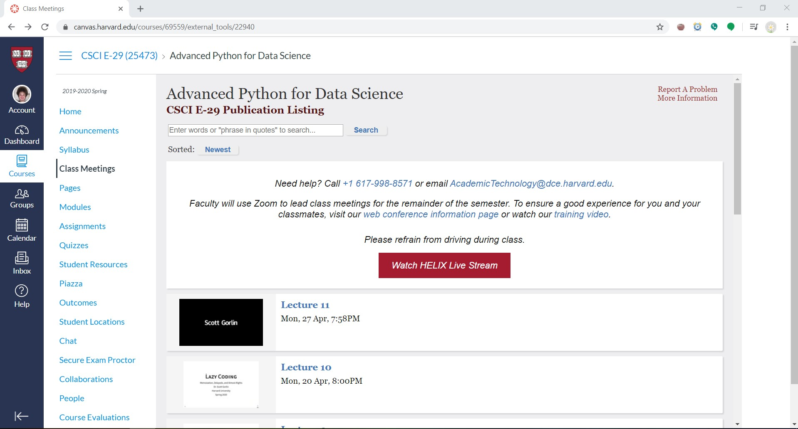
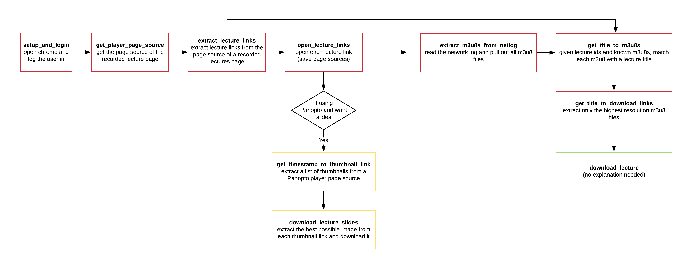

# CSCI E-29 Final Project

### Short Description

The purpose of this project is to download all lectures and slides (if applicable AND wanted) using  a link to a "Recorded Lectures" page on Canvas. Once lectures are downloaded, they can also be upload to an S3 bucket, if desired.

This is designed to work with both Harvard players. I refer to the "normal" player as the "Matterhorn" player (as all lecture links look like `matterhorn.dce.harvard.edu...`). The other player is called "Panopto" (with links like `harvard.hosted.panopto.com...`). When downloading from the Panopto player, slides can be downloaded if desired (by use of a command line flag).

### Setup

**Requirement**: have a Chromium based browser installed (for most people this will just be Google Chrome).

1. Clone this repository to your computer.

2. Setup the project virtual environment by running `pipenv install`. This assumes `pipenv` is already installed.

3. Add your information to a `.env` file.
    - CANVAS_USERNAME=XXX
    - CANVAS_PASSWORD=XXX
    - AWS_ACCESS_KEY_ID=XXX
    - AWS_SECRET_ACCESS_KEY=XXX
    - S3_ROOT=s3://BUCKET_NAME/PATH `example: s3://etrilling-cscie29/recorded_lectures`
    - (optional) VIDEO_PATH=DOWNLOAD_LOCATION_FOR_VIDEOS `default: ./data/videos`

4. Visit https://chromedriver.chromium.org/downloads and download the correct ChromeDriver file for your computer. If needed, unzip the download to get the `chromedriver` file. Place the `chromedriver` file in `./data/drivers/`.

5. Start the project by running `pipenv run python -m final_project <COMMAND> <TARGET_URL> [--full] [--process_slides]`
    - `<COMMAND>`: choose either `download` or `upload`. `download` will download the lectures. `upload` will first call `download` and then upload the lectures to S3.

    - `<TARGET_URL>`: the url of a "Recorded Lectures" page on Canvas.\
    Example:
    
    Here, the correct `<TARGET_RUL>` is `https://canvas.harvard.edu/courses/69812/external_tools/22940`

    - `--process_slides`: if the player type is Panopto and this flag is set, slides will be processed (downloaded / uploaded) along with the lectures.

    - `--full`: when this flag is set, the entire lecture and slides (if applicable AND wanted) will be downloaded. When not set, the program will spend only 1 second downloading each lecture and only 2 slides will be downloaded (if applicable AND wanted). This is meant as a test for the user.

6. If you are downloading from a given Canvas link for the first time, an instance of Google Chrome will pop up and automatically log you into Canvas. **You will need to manually confirm the automatic 2-Factor Authentication (2FA) call**. Once logged in, the webdriver will proceed to open each lecture. Please do not click on anything while this is happening (if you do, you may need to re-run the command). Once finished, the Google Chrome instance will close and the program will start processing information in the background. You should only have to go through this process the first time you download from a given Canvas link. Afterwards, the required information will be written to a cache file for future use.
    - NOTE: the program will automatically click "Call Me" on your default 2FA option. If you need to authenticate via a different number, cancel the default call, select the number you would prefer, and click "Call Me" manually. You have 120 seconds to finish the procedure before the script decides an error occurred and exits the program.

7. Wait for the program to finish. Often 30-50GB of data will need to be downloaded and optionally uploaded to S3. Depending on the strength of your internet connection, this process could take several of hours.
    - NOTE: As a first pass, I would highly suggest running your command of choice without the `--full` flag in order to make sure everything is working correctly. Then, you will need to delete the downloaded/uploaded local (and optinally S3) files before running the command *with* the `--full` flag (luigi can't tell a difference between `short` and `full` files).

### How does this work?

In order to understand how this program works, it's first helpful to understand how to download a lecture manually. Because explaining this process in text/images would be a terrible experience for all parties involved, I've recorded a video detailing how to manually download lectures. Here is the link: https://youtu.be/RqG7gyKWVeA

With the understanding that you've watched that video (8min) here's how this works:
1. The Google Chrome instance started by this program has a special flag such that it records all network traffic to a specific log file (found at `./data/tmp/net_log.json`). As noted in `Step 6` of `Setup`, the program will open all lecture links. As this is happening, it is recording all network activity to the log file. After Chrome has been closed, we can extract each lecture's m3u8 files from the network log. This is the same process I did manually using the network tab of developer tools in the video.

2. Once we have all of the base m3u8's, we begin the long and tedious process of pairing m3u8's with their corresponding lecture and then extracting the links that correspond to the highest resolution videos. Once this data has been extracted, it is cached to a pkl file so this process doesn't need to be repeated.

3. We download each lecture using either the `mp4` or `ts` files we've extracted. We can also download slides through a little HTML scraping if using the Panopto player (and requested by the user).

4. If `upload` was requested, then each lecture is uploaded to S3. We also upload each lecture's slides (if applicable)

**A little flow chart of the functions defined in `scrape.py`**

### A note on testing:

As far as I am aware, it is not possible to test the web scraper in any reasonable way. Because it's quite context dependent, I really don't think much testing could be done. Because the `SaveLectureData` luigi task makes heavy use of the web scraper, it is equally untestable. The only potentially testable tasks are the `Download`/`Upload` `Lecture`/`Slides`. I may add testing for these tasks if I find I have the time!
